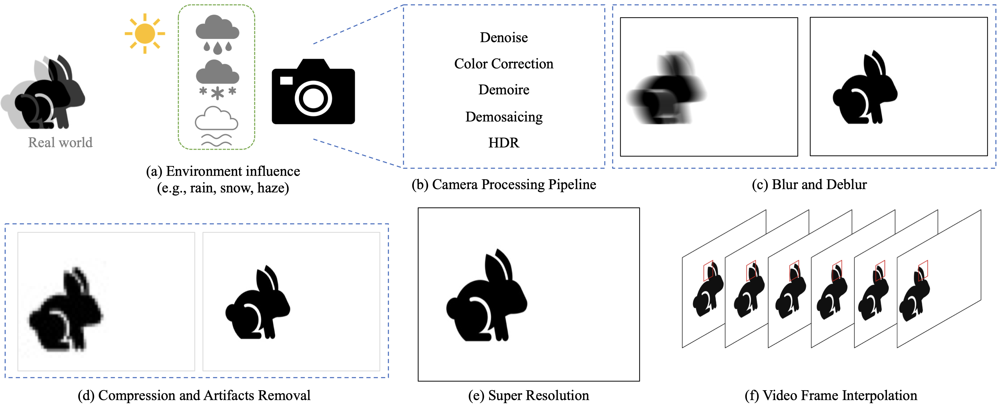
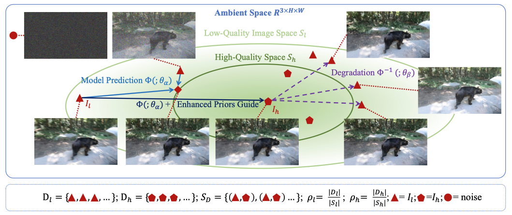

<!--A curated list of resources for Image and Video Deblurring-->
<!-- PROJECT LOGO -->

  <h2 align="center">Awesome-Image-Prior</h2>
  
A curated list of resources for Prior in Image or Video 
     
     
     
    <a href="https://github.com/yunfanLu/Awesome-Image-Prior/pulls/new">Suggest new item</a>
     
    <a href="https://github.com/yunfanLu/Awesome-Image-Prior/issues/new">Report Bug</a>
  

<h2>Table of contents</h2>

- [Image Enhancement Classification](#image-enhancement-classification)
- [Prior Classification](#prior-classification)
- [1.Ruled Prior](#1ruled-prior)
  - [1.1 High-Level Semantic Information as Prior](#11-high-level-semantic-information-as-prior)
  - [1.2 Image Statistical Features as Prior](#12-image-statistical-features-as-prior)
    - [1.2.1 Heavy-tailed Gradient Distributions](#121-heavy-tailed-gradient-distributions)
    - [1.2.2 Statistical Gradient Feature](#122-statistical-gradient-feature)
  - [1.3 Temporal Prior](#13-temporal-prior)
    - [1.2.1 Optical Flow](#121-optical-flow)
    - [1.2.2 Temporal Sharpness Prior](#122-temporal-sharpness-prior)
  - [1.4 Transformation as Prior](#14-transformation-as-prior)
    - [1.4.1 Learning with Frequency Information](#141-learning-with-frequency-information)
    - [1.4.2 Other Transformation](#142-other-transformation)
  - [1.5 Physical-based Priors](#15-physical-based-priors)
    - [1.5.1 Atmospheric Scattering Model](#151-atmospheric-scattering-model)
    - [1.5.2 Rain Model](#152-rain-model)
    - [1.5.3 Retinex Model](#153-retinex-model)
  - [1.6 Explicit Modelling Kernel and Noise Information as Prior](#16-explicit-modelling-kernel-and-noise-information-as-prior)
    - [1.6.1 Explicit Modelling in Modular Design](#161-explicit-modelling-in-modular-design)
    - [1.6.2 Explicit Modelling in Training Set Synthetic](#162-explicit-modelling-in-training-set-synthetic)
  - [1.7 Data Degradation as Prior](#17-data-degradation-as-prior)
    - [1.7.1 Motion Blur Model](#171-motion-blur-model)
    - [1.7.2 Compression Information as Prior](#172-compression-information-as-prior)
- [2. Latent Prior](#2-latent-prior)
  - [2.1 Non-local Self-similarity](#21-non-local-self-similarity)
  - [2.2 Facial Prior](#22-facial-prior)
  - [2.3 Deep Image Prior](#23-deep-image-prior)
  - [2.4 Pre-trained Model as Prior](#24-pre-trained-model-as-prior)
    - [2.4.1 GAN Prior](#241-gan-prior)
    - [2.4.2 Generative Priors in Training Set Synthetic](#242-generative-priors-in-training-set-synthetic)
    - [2.4.3 Deep Denoiser Prior for Regularization](#243-deep-denoiser-prior-for-regularization)

# Image Enhancement Classification

# Prior Classification

# 1.Ruled Prior

## 1.1 High-Level Semantic Information as Prior

**Definition:**

|Conference|Title|Task|
| ---- | :----------------------------------------------------------- | ---------- |
| TIP 2018 | Deep video dehazing with semantic segmentation              | Video Dehazing |
| CVPR 2018 | Deep semantic face deblurring | Human Face Deblur |
| CVPR 2018 | Recovering realistic texture in image super-resolution by deep spatial feature transform | Super-Resolution |
| CVPR 2018 | High-resolution image synthesis and semantic manipulation with conditional gans | Super-Resolution |
| CVPR 2019 | Human-aware motion deblurring | Human Motion Deblur |
| ICCV 2019 | Srobb: Targeted perceptual loss for single image superresolution | Super-Resolution |
| CVPR 2020 | Dual super-resolution learning for semantic segmentation | Super-Resolution |
| ACM-MM 2020 | Integrating semantic segmentation and retinex model for low-light image enhancement | Low-light; Denoise |
| CVPR 2021 | Progressive semantic-aware style transformation for blind face restoration | Human Face Restoration |
| ICCV 2021 | Spatiallyadaptive image restoration using distortion-guided networks | Image Restoration |
| ACM-MM 2022 | Close the loop: A unified bottomup and top-down paradigm for joint image deraining and segmentation | Deraining |
| WACV 2022 | Sapnet: Segmentation-aware progressive network for perceptual contrastive deraining | Deraining |

## 1.2 Image Statistical Features as Prior

### 1.2.1 Heavy-tailed Gradient Distributions

### 1.2.2 Statistical Gradient Feature

## 1.3 Temporal Prior

### 1.2.1 Optical Flow

### 1.2.2 Temporal Sharpness Prior

## 1.4 Transformation as Prior

### 1.4.1 Learning with Frequency Information

### 1.4.2 Other Transformation

## 1.5 Physical-based Priors

### 1.5.1 Atmospheric Scattering Model

### 1.5.2 Rain Model

### 1.5.3 Retinex Model

## 1.6 Explicit Modelling Kernel and Noise Information as Prior

### 1.6.1 Explicit Modelling in Modular Design

### 1.6.2 Explicit Modelling in Training Set Synthetic

## 1.7 Data Degradation as Prior

### 1.7.1 Motion Blur Model

### 1.7.2 Compression Information as Prior

# 2. Latent Prior

## 2.1 Non-local Self-similarity

## 2.2 Facial Prior

## 2.3 Deep Image Prior

## 2.4 Pre-trained Model as Prior

### 2.4.1 GAN Prior

### 2.4.2 Generative Priors in Training Set Synthetic

### 2.4.3 Deep Denoiser Prior for Regularization

